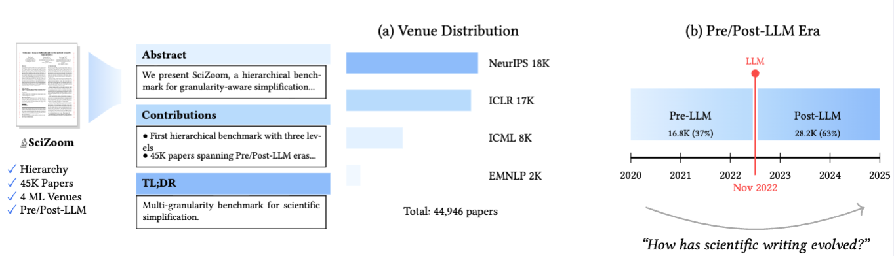

# 🔬 SciZoom: A Large-scale Benchmark for Hierarchical Scientific Summarization across the LLM Era

### A Large-scale Benchmark for Hierarchical Scientific Summarization across the LLM Era

<!-- 
<p align="center">
  <a href="https://janghana.github.io/SciZoom">
    
  </a>
  &nbsp;&nbsp;
  <a href="https://openreview.net/forum?id=XXXXX">
    
  </a>
  &nbsp;&nbsp;
  <a href="https://huggingface.co/datasets/hanjang/SciZoom">
    
  </a>
</p> -->

<p align="center">
  <a href="https://janghana.github.io/SciZoom">🌐 Project</a> | 
  <a href="https://openreview.net/forum?id=XXXXX">📄 Paper</a> | 
  <a href="https://huggingface.co/datasets/hanjang/SciZoom">🤗 Dataset</a>
</p>



## TL;DR

**SciZoom** is a large-scale benchmark for hierarchical scientific summarization comprising **44,946 papers** from NeurIPS, ICLR, ICML, and EMNLP (2020-2025), stratified into Pre-LLM and Post-LLM eras.

- **Hierarchical Annotations**: Full Text → Abstract (70:1) → Contributions (110:1) → TL;DR (600:1)
- **Temporal Stratification**: Pre-LLM (37.3%) vs Post-LLM (62.7%) around Nov 2022 ChatGPT release

## Quick Start

### Installation
```bash
git clone https://github.com/janghana/SciZoom.git
cd SciZoom
bash setup_scizoom.sh
```

### Load Dataset
```python
from datasets import load_dataset

dataset = load_dataset("hanjang/SciZoom")

for paper in dataset["test"]:
    print(paper["title"])
    print(paper["abstract"])
    print(paper["contributions"])
    print(paper["era"])  # 'pre-llm' or 'post-llm'
```

For detailed data exploration and analysis, see [`tutorials.ipynb`](notebook/tutorials.ipynb).

## LLM Inference

### Summarization with vLLM

For efficient LLM inference, we recommend [vLLM](https://github.com/vllm-project/vllm).

```bash
pip install vllm
```

See official documentation: https://docs.vllm.ai/

### Embedding with NV-Embed-v2

For semantic similarity analysis, we use [NV-Embed-v2](https://huggingface.co/nvidia/NV-Embed-v2).

See official model card: https://huggingface.co/nvidia/NV-Embed-v2

## Tutorials

See [`tutorials.ipynb`](notebook/tutorials.ipynb) for:
- Data loading and exploration
- Era-based analysis & visualization
- Hierarchical summarization evaluation
- Cross-granularity similarity analysis

## Citation

```bibtex
@article{jang2026scizoom,
  title={SciZoom: A Large-scale Benchmark for Hierarchical Scientific Summarization across the LLM Era},
  author={Jang, Han and Lee, Junhyeok and Choi, Kyu Sung},
  journal={arXiv preprint arXiv:XXXX.XXXXX},
  year={2026}
}
```

## License

- **Dataset**: [CC-BY-4.0](https://creativecommons.org/licenses/by/4.0/)
- **Code**: MIT License

## Acknowledgments

This work was conducted at the [AICON Lab](https://sites.google.com/view/snuhradaicon/research-team/researchers?authuser=0) (Advanced Imaging and Computational Neuroimaging Laboratory), Department of Radiology, Seoul National University Hospital.

## Contact

- **Han Jang** - hanjang@snu.ac.kr | [janghana](https://janghana.github.io/) | [Google Scholar](https://scholar.google.com/citations?hl=en&user=b6IRRlsAAAAJ)
- **AICON Lab** - [snuh-rad-aicon](https://github.com/snuh-rad-aicon)